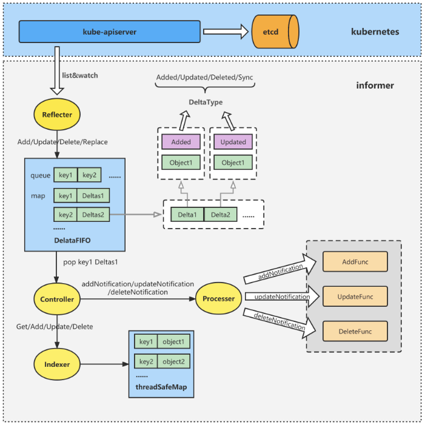

### client-go

client-go是k8s官方维护的一个go代码库，用于go程序与k8s集群的交互。除了提供交互的功能之外，client-go还实现了本地缓存、事件队列、事件处理器等功能。client-go在k8s的组件中有着广泛的使用，在学习k8s源码的过程中，client-go是第一个需要了解学习的代码库。

### informer架构
informer是client-go中一个很重要的组件

### informer的子组件
- Reflector：负责从kube-apiserver中List&Watch资源对象，然后调用DeltaFIFO的方法将资源对象及其变化打包成Delta然后丢到DeltaFIFO的队列中
- DeltaFIFO：k8s自己实现的消息队列，Reflector作为生产者负责这个队列的输入，Controller作为消费者负责这个队列的输出
- Controller：负责从DeltaFIFO队列中pop取出一个object，并获取其关联的Deltas进行处理
    - 根据对象的变化更新到本地的内存缓存Indexer中
    - 通知Processer，调用相应的ResourceEventHandler来处理对象的变化
- Indexer：维护了指定资源对象相对于etcd数据的一份本地内存缓存，通过获取缓存的资源对象，减少对apiserver、etcd的请求压力
- ResourceEventHandler：根据用户自身逻辑相应，注册自定义的ResourceEventHandler，当关注的资源对象发生变化时，将触发Handler执行相应的动作
- Lister：从Indexer中读取资源对象，减少对apiserver、etcd的请求压力