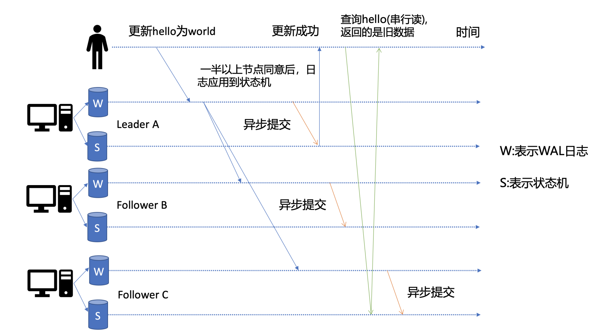
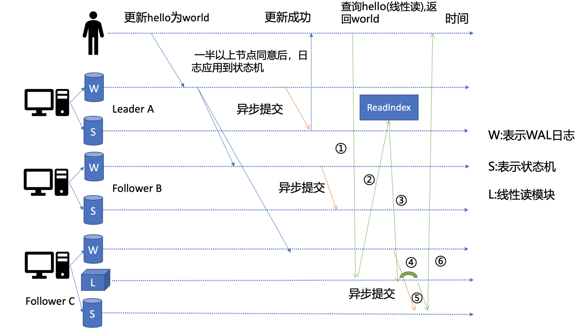

## 基础架构
etcd的基础架构图如下


按照分层模型，etcd分为client层、api网络层、raft算法层、逻辑层、存储层。
- client层：包括client v2和v3两个大版本的API客户端库，支持负载均衡，节点间故障自动转移。
- API网络层：包括client访问server和server节点之间的通信协议。
- raft算法层：这一层实现了leader选举、日志复制、readindex等核心算法特性，用于保障etcd多个节点之间的数据一致性、提升服务可用性等。
- 功能逻辑层：etcd核心特性实现层，KVServer模块，MVCC模块，Auth鉴权模块，Lease租约模块，Compactor压缩模块等，其中MVCC模块由treeIndex模块和boltdb模块组成。
- 存储层：包括WAL日志模块，Snapshot快照模块，boltdb模块。其中WAL保障etcd crash后数据不丢失，boltdb保障集群元数据和用户写入的数据。

> client访问etcd server分为v2和v3两个版本。
>
> v2 API使用HTTP/1.x协议，v3 API使用基于HTTP/2的gRPC协议。
>
> 另一方面，server之间通信协议，是指节点间通过raft算法实现数据复制和leader选举等功能时使用的HTTP协议。
>
> HTTP/2 是基于二进制而不是文本、支持多路复用而不再有序且阻塞、支持数据压缩以减少包大小、支持 server push 等特性。
>
> 因此，基于 HTTP/2 的 gRPC 协议具有低延迟、高性能的特点，有效解决了我们在上一讲中提到的 etcd v2 中 HTTP/1.x 性能问题。

## etcd读请求的执行流程

以一次get请求为例子
```shell script
# ETCDCTL_API=3 ./etcdctl get hello --endpoints=http://127.0.0.1:2379
hello 
world
```
"endpoints"是我们后端的etcd地址，通常生产环境下中需要配置多个endpoints，这样在etcd节点出现故障后，client就可以自动重连到其它正常的节点，从而保证请求的正常执行。


在 etcd v3.4.9版本中，etcdctl是通过 clientv3库来访问 etcd server，clientv3 库基于gRPC client API封装了操作 etcd KVServer、Cluster、Auth、Lease、Watch等模块的API，同时还包含了负载均衡、健康探测和故障切换等特性。

在解析完请求中的参数后，etcdctl 会创建一个 clientv3 库对象，使用 KVServer 模块的 API 来访问 etcd server。

关于clientv3的负载均衡算法，有两点需要注意
1. 如果client版本<=3.3，那么当你配置多个endpoint时，负载均衡算法仅会从中选择一个IP并创建一个连接（Pinned endpoint），这样可以节省服务器总连接数。但在heavy usage场景，可能会造成server负载不均衡。
2. 在client 3.4之前的版本中，负载均衡算法有一个严重的Bug：如果第一个节点异常了，可能会导致你的client访问etcd server异常，特别是在Kubernetes场景中会导致APIServer不可用。不过，该Bug已在Kubernetes 1.16版本后被修复。

### 串行读与线性读
先看看<u>写流程</u>的简单示意图

如下图所示，当client发起一个更新hello为world请求后，若leader收到写请求，它会将此请求持久化到WAL日志，并广播给各个节点，若一半以上节点持久化成功，则该请求对应的日志条目被标识为已提交，etcdserver模块异步从raft模块获取已提交的日志条目，应用到状态机 (boltdb 等)。

此时如果client发出一个读取hello的请求，假设该请求是直接从状态机里读取，并且连接的是C节点。而C节点刚好出现I/O波动，导致它应用已提交的日志缓慢，则会出现读取hello值的时候，更新hello的日志还没提交到状态机，导致读出来的是旧数据。

在多节点的etcd集群中，各个节点的状态机数据一致性存在差异。而不同业务场景的读请求对数据是否最新的容忍度是不一样的，有的场景它可以容忍数据落后几秒甚至几分钟，有的场景要求必须读到反映集群共识的最新数据。
1. 串行读：直接读取状态机的数据返回，无需通过raft模块与集群其他节点进行交互。可能存在读取到的数据滞后，适合对数据敏感度不高的场景。
2. 线性读：<u>etcd默认的读取模式</u>，会通过raft模块保证读取到的最新的数据

### 线性读之readindex

当集群的节点收到一个线性读请求之后，节点会先发一个readindex的请求给集群的leader，获取集群最新的已提交的日志索引（committed index）。

leader收到readindex请求时，为防止脑裂等异常场景，会向follower发送心跳确认，一半以上节点确认leader身份后才能将已提交的索引 (committed index) 返回给节点。

节点收到readindex之后，等待本身的状态机的应用索引(applied index)大于等于leader的已提交索引时 (committed Index)之后通知读请求读取状态机的数据。

> 早期etcd线性读使用的Raft log read，也就是说把读请求像写请求一样走一遍Raft的协议，基于Raft的日志的有序性，实现线性读。
> 但此方案读涉及磁盘IO开销，性能较差，后来实现了ReadIndex读机制来提升读性能，满足了Kubernetes等业务的诉求。

### MVCC
多版本并发控制(Multiversion concurrency control)模块是为了解决上一讲我们提到etcd v2不支持保存key的历史版本、不支持多key事务等问题而产生的。它核心由内存树形索引模块（treeIndex）和嵌入式的kv持久化存储库boltdb组成。
> boltdb，它是个基于 B+ tree 实现的 key-value 键值库，支持事务，提供 Get/Put 等简易 API 给 etcd 操作。

boltdb的key是全局递增的版本号 (revision)，value是用户key、value等字段组合成的结构体，然后通过treeIndex模块来保存用户key和版本号的映射关系。

treeIndex与boltdb关系如下面的读事务流程图所示，从treeIndex中获取key hello的版本号，再以版本号作为boltdb的key，从boltdb中获取其value信息。

在获取到版本号信息后，就可从boltdb模块中获取用户的key-value数据了。不过有一点你要注意，并不是所有请求都一定要从boltdb获取数据。etcd出于数据一致性、性能等考虑，在访问boltdb前，首先会从一个内存读事务buffer中，二分查找你要访问key是否在buffer里面，若命中则直接返回。

MVCC机制是基于多版本技术实现的一种乐观锁机制，它乐观地认为数据不会发生冲突，但是当事务提交时，具备检测数据是否冲突的能力。

更新一个 key-value 数据的时候，它并不会直接覆盖原数据，而是新增一个版本来存储新的数据，每个数据都有一个版本号。即使是删除数据的时候，它实际也是新增一条带删除标识的数据记录。<u>当你指定版本号读取数据时，它实际上访问的是版本号生成那个时间点的快照数据。</u>
#### treeIndex的数据结构
在treeIndex中，每个节点的key是一个keyIndex结构，etcd就是通过它保存了用户的key与版本号的映射关系。
```golang
type keyIndex struct {
    key []byte // 用户的key名称
    modified revision // 最后一次修改key时的etcd版本号
    generations []generation // generation保存了一个key若干代版本号信息
}
```
generations表示一个key从创建到删除的过程，每代对应key的一个生命周期的开始与结束。当你第一次创建一个 key 时，会生成第0代，后续的修改操作都是在往第0代中追加修改版本号。当你把key删除重新创建之后就会生成第1代，以此类推。
```golang
type generation struct { 
    ver int64 // 表示此key的修改次数 
    created revision // 表示generation结构创建时的版本号 
    revs []revision // 每次修改key时的revision追加到此数组
}
```
revision版本号并不是一个简单的整数，而是一个结构体。
```golang
type revision struct {
    main int64 // 一个全局递增的主版本号，随put/txn/delete事务递增，一个事务内的key main版本号是一致的 
    sub int64 // 一个事务内的子版本号，从0开始随事务内put/delete操作递增
}
```
#### boltdb的数据结构
boltdb是一个key-value的存储系统，key为revision结构体，value也是一个结构体，它是由用户key、value、create_revision、mod_revision、version、lease 组成
- create_revision表示此key创建时的版本号，也就是treeIndex中keyIndex.generations[i].created 字段
- mod_revision表示key最后一次修改时的版本号，即put操作发生时的全局版本号加1
- version表示此key的修改次数，也就是treeIndex中keyIndex.generations[i].ver 字段
#### MVCC查询key的流程
1. treeIndex模块从B-tree中，根据key查找到keyIndex对象
2. keyIndex对象匹配有效的generation
3. 如果不带版本号读则读取最新的数据，返回generation中最后一个revision
4. 如果带了版本号查询（假如为N），则在generation中遍历所有revisions，返回小于等于N的最大revision（key在N的revision时候不一定有数据，所以是返回小于等于N中的最大值）
5. 根据返回的revision去boltdb中查询并返回数据
#### MVCC删除key的流程
1. 与更新key不一样的是，生成的boltdb key版本号{N,0,t}追加了删除标识（tombstone, 简写t），boltdb value变成只含用户key的KeyValue结构体
2. treeIndex给key的keyIndex追加一个空的generation对象，表示此索引对应的key被删除了
3. 再次查询key的时候发现keyIndex存在空的generation对象，并且查询的版本大于等于被删除时候的版本号，则返回空
> tombstone删除标注有两个作用
> 1. 生成delete的event事件
> 2. 重启etcd，遍历boltdb中的key构建treeIndex内存树时，需要知道哪些key是被删除了的
> 3. 真正删除treeIndex中的索引对象、boltdb中的key是通过压缩 (compactor) 组件异步完成。
>
> 正因为 etcd的删除key操作是基于以上延期删除原理实现的，因此只要压缩组件未回收历史版本，我们就能从etcd中找回误删的数据。