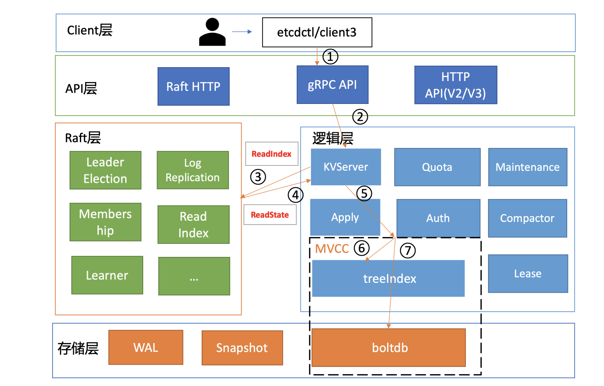

### 基础架构
etcd的基础架构图如下


按照分层模型，etcd分为client层、api网络层、raft算法层、逻辑层、存储层。
- client层：包括client v2和v3两个大版本的API客户端库，支持负载均衡，节点间故障自动转移。
- API网络层：包括client访问server和server节点之间的通信协议。client访问etcd server分为v2和v3两个版本。v2 API使用HTTP/1.x协议，v3 API使用gRPC协议。另一方面，server之间通信协议，是指节点间通过raft算法实现数据复制和leader选举等功能时使用的HTTP协议。
- raft算法层：这一层实现了leader选举、日志复制、readindex等核心算法特性，用于保障etcd多个节点之间的数据一致性、提升服务可用性等。
- 功能逻辑层：etcd核心特性实现层，KVServer模块，MVCC模块，Auth鉴权模块，Lease租约模块，Compactor压缩模块等，其中MVCC模块由treeIndex模块和boltdb模块组成。
- 存储层：包括WAL日志模块，Snapshot快照模块，boltdb模块。其中WAL保障etcd crash后数据不丢失，boltdb保障集群元数据和用户写入的数据。

### etcd读请求的执行流程

以一次get请求为例子
```shell script
# ETCDCTL_API=3 ./etcdctl get hello --endpoints=http://127.0.0.1:2379
hello 
world
```
"endpoints"是我们后端的etcd地址，通常生产环境下中需要配置多个endpoints，这样在etcd节点出现故障后，client就可以自动重连到其它正常的节点，从而保证请求的正常执行。\
在 etcd v3.4.9版本中，etcdctl是通过 clientv3库来访问 etcd server，clientv3 库基于gRPC client API封装了操作 etcd KVServer、Cluster、Auth、Lease、Watch等模块的API，同时还包含了负载均衡、健康探测和故障切换等特性。\