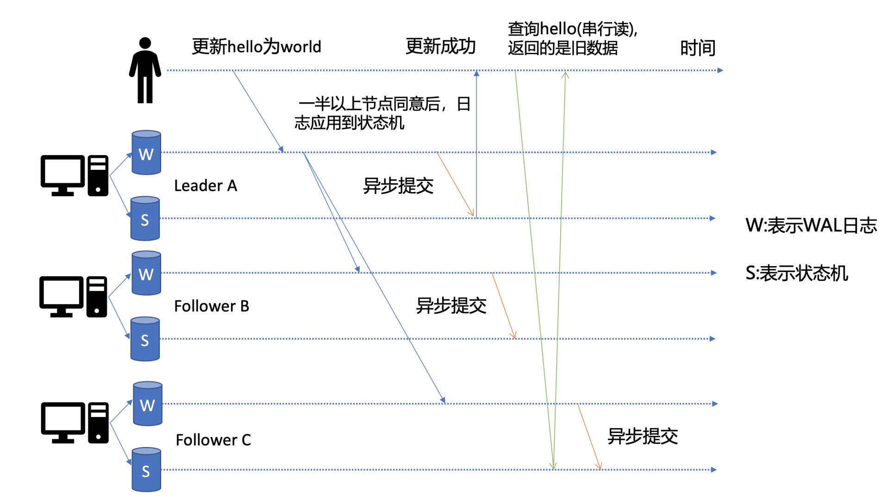
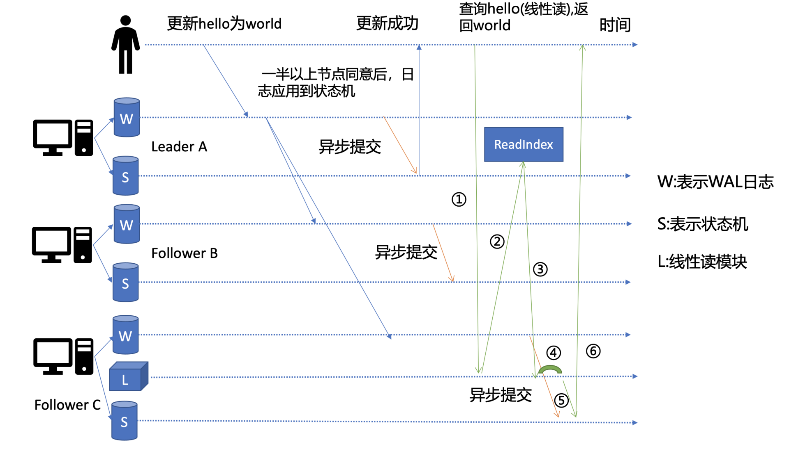

## etcd读请求的执行流程

以一次get请求为例子
```shell script
# ETCDCTL_API=3 ./etcdctl get hello --endpoints=http://127.0.0.1:2379
hello 
world
```
"endpoints"是我们后端的etcd地址，通常生产环境下中需要配置多个endpoints，这样在etcd节点出现故障后，client就可以自动重连到其它正常的节点，从而保证请求的正常执行。


在 etcd v3.4.9版本中，etcdctl是通过 clientv3库来访问 etcd server，clientv3 库基于gRPC client API封装了操作 etcd KVServer、Cluster、Auth、Lease、Watch等模块的API，同时还包含了负载均衡、健康探测和故障切换等特性。

在解析完请求中的参数后，etcdctl 会创建一个 clientv3 库对象，使用 KVServer 模块的 API 来访问 etcd server。

关于clientv3的负载均衡算法，有两点需要注意
1. 如果client版本<=3.3，那么当你配置多个endpoint时，负载均衡算法仅会从中选择一个IP并创建一个连接（Pinned endpoint），这样可以节省服务器总连接数。但在heavy usage场景，可能会造成server负载不均衡。
2. 在client 3.4之前的版本中，负载均衡算法有一个严重的Bug：如果第一个节点异常了，可能会导致你的client访问etcd server异常，特别是在Kubernetes场景中会导致APIServer不可用。不过，该Bug已在Kubernetes 1.16版本后被修复。

### 串行读与线性读
先看看<u>写流程</u>的简单示意图

如下图所示，当client发起一个更新hello为world请求后，若leader收到写请求，它会将此请求持久化到WAL日志，并广播给各个节点，若一半以上节点持久化成功，则该请求对应的日志条目被标识为已提交，etcdserver模块异步从raft模块获取已提交的日志条目，应用到状态机 (boltdb 等)。

此时如果client发出一个读取hello的请求，假设该请求是直接从状态机里读取，并且连接的是C节点。而C节点刚好出现I/O波动，导致它应用已提交的日志缓慢，则会出现读取hello值的时候，更新hello的日志还没提交到状态机，导致读出来的是旧数据。

在多节点的etcd集群中，各个节点的状态机数据一致性存在差异。而不同业务场景的读请求对数据是否最新的容忍度是不一样的，有的场景它可以容忍数据落后几秒甚至几分钟，有的场景要求必须读到反映集群共识的最新数据。
1. 串行读：直接读取状态机的数据返回，无需通过raft模块与集群其他节点进行交互。可能存在读取到的数据滞后，适合对数据敏感度不高的场景。
2. 线性读：<u>etcd默认的读取模式</u>，会通过raft模块保证读取到的最新的数据

### 线性读之readindex

当集群的节点收到一个线性读请求之后，节点会先发一个readindex的请求给集群的leader，获取集群最新的已提交的日志索引（committed index）。

leader收到readindex请求时，为防止脑裂等异常场景，会向follower发送心跳确认，一半以上节点确认leader身份后才能将已提交的索引 (committed index) 返回给节点。

节点收到readindex之后，等待本身的状态机的应用索引(applied index)大于等于leader的已提交索引时 (committed Index)之后通知读请求读取状态机的数据。

> 早期etcd线性读使用的Raft log read，也就是说把读请求像写请求一样走一遍Raft的协议，基于Raft的日志的有序性，实现线性读。
> 但此方案读涉及磁盘IO开销，性能较差，后来实现了ReadIndex读机制来提升读性能，满足了Kubernetes等业务的诉求。
