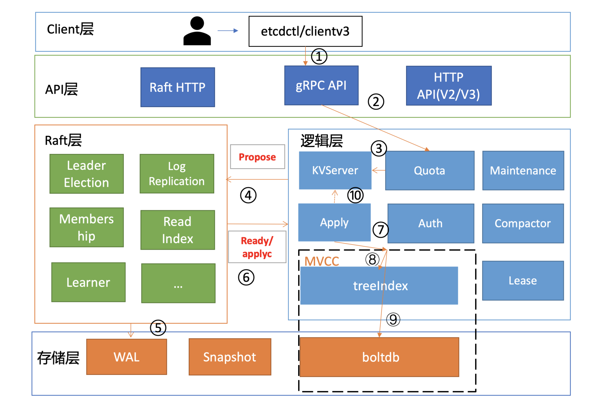
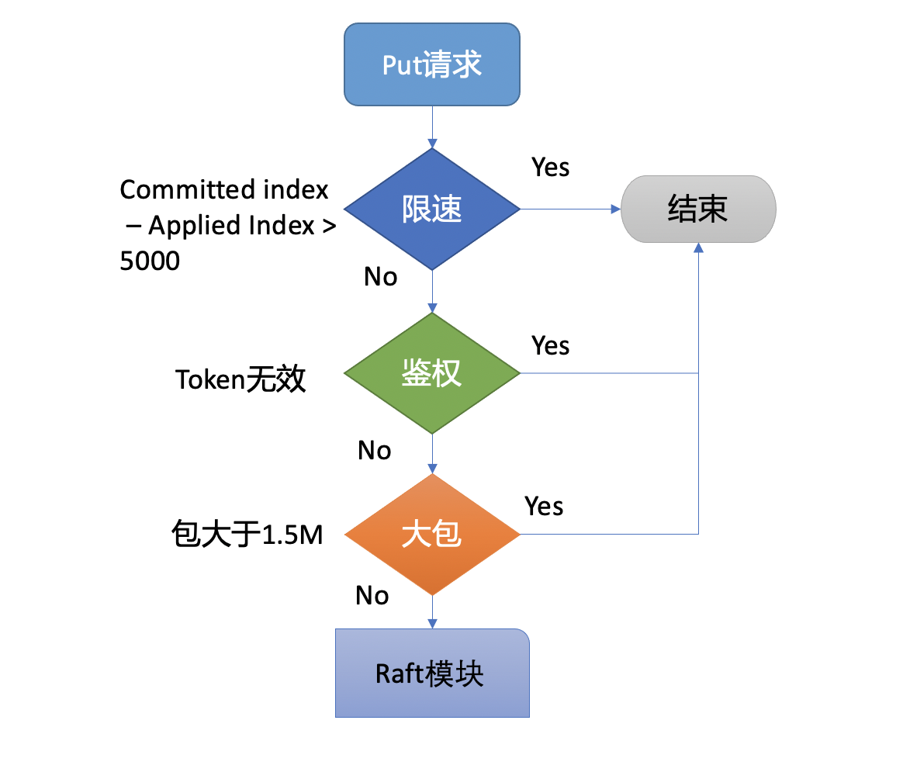
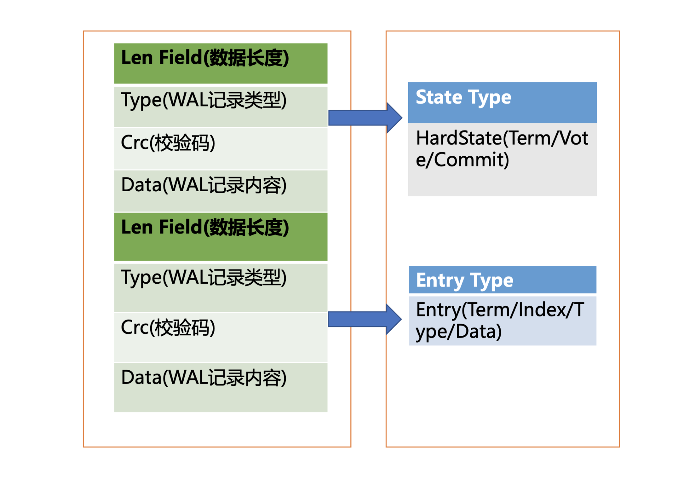
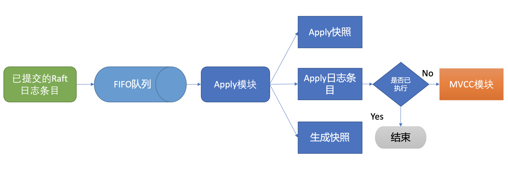

## etcd写请求执行流程

```shell script
# etcdctl put hello world --endpoints http://127.0.0.1:2379
OK

```
client端通过负载均衡算法选择一个etcd节点，发起gRPC调用。经过gRPC拦截器、Quota模块之后，进入KVServer模块。

KVServer模块向Raft模块提交一个提案，提案通过之后经过WAL模块持久化到磁盘，提案的状态变为已提交。

etcdserver从Raft模块获取已提交的日志条目，传递给Apply模块，Apply模块通过MVCC模块执行提案内容，更新状态机。

### Quota模块
Quota模块用于限制etcd集群db数据大小。当前etcd db文件大小超过了配额，那么写请求将返回```etcdserver: mvcc: database space exceeded```的错误。

当etcd server收到put/txn等写请求的时候，会首先检查下当前etcd db大小加上你请求的key-value 大小之和是否超过了配额（quota-backend-bytes）。超过则集群拒绝写入。

Apply模块在执行每个命令的时候，都会去检查当前是否存在NO SPACE告警，如果有则拒绝写入。所以在调整配额之后还需要额外发送一个取消告警（etcdctl alarm disarm）的命令，以消除所有告警。

### KVServer模块
请求通过Quota模块的配额检查之后，将由KVServer模块将请求打包成一个提案请求发送给Raft模块。不过KVServer模块在提交提案前，还有如下的一系列检查和限速。

### Preflight Check

#### 限速
如果Raft模块已提交的日志索引（committed index）比已应用到状态机的日志索引（applied index）超过了5000，那么它就返回一个```etcdserver: too many requests```错误给 client。
#### 鉴权
尝试去获取请求中的鉴权信息，若使用了密码鉴权、请求中携带了token，如果token无效，则返回```auth: invalid auth token```错误给 client。
#### 包大小检查
检查写入的包大小是否超过默认的 1.5MB， 如果超过了会返回```etcdserver: request is too large```错误给给 client。

### Propose
检查之后，会生成一个唯一的ID，将此请求关联到一个对应的消息通知channel，然后向Raft模块发起（Propose）一个提案（Proposal）.

KVServer模块发起提案请求之后会等待此 put 请求，等待写入结果通过消息通知 channel 返回或者超时。etcd 默认超时时间是7秒（5秒磁盘IO延时+2*1秒竞选超时时间），如果一个请求超时未返回结果，则可能出现```etcdserver: request timed out```错误。

### WAL模块
Raft模块收到提案之后，如果当前节点是follower，它会提案转发给leader，只有leader才能处理写请求。

leader收到提案后，通过Raft模块输出待转发给follower节点的消息和待持久化的日志条目，日志条目包括提案的内容。

etcdserver从Raft模块获取到以上消息和日志条目后，作为leader，它会将提案消息广播给集群各个节点，同时需要把集群leader任期号、投票信息、已提交索引、提案内容持久化到一个 WAL（Write Ahead Log）日志文件中，用于保证集群的一致性、可恢复性。
#### WAL日志结构

WAL日志由<u>多种不同类型的WAL记录顺序追加写入组成</u>，每个WAL记录由类型（Type）、数据（Data）、循环冗余码（CRC）组成。

WAL记录目前有5种类型：
- 文件元数据记录，包含节点ID、集群ID信息，它在WAL文件创建的时候写入
- 日志条目记录包含Raft日志信息，如 put 提案内容
- 状态信息记录，包含集群的任期号、节点投票信息等，一个日志文件中会有多条，以最后的记录为准
- CRC记录包含上一个WAL文件的最后的CRC信息，在创建、切割 WAL 文件时，作为第一条记录写入到新的 WAL 文件，用于校验数据文件的完整性、准确性等
- 快照记录包含快照的任期号、日志索引信息，用于检查快照文件的准确性

Raft日志条目的数据结构信息由以下字段组成：
- Term是leader任期号，随着leader选举增加
- Index是日志条目的索引，单调递增增加
- Type是日志类型，比如是普通的命令日志（EntryNormal）还是集群配置变更日志（EntryConfChange）
- Data保存put提案内容
```golang
type Entry struct {
    Term    uint64    `protobuf:"varint，2，opt，name=Term" json:"Term"`
    Index   uint64    `protobuf:"varint，3，opt，name=Index" json:"Index"`
    Type    EntryType `protobuf:"varint，1，opt，name=Type，enum=Raftpb.EntryType" json:"Type"`
    Data    []byte    `protobuf:"bytes，4，opt，name=Data" json:"Data，omitempty"`
}
```
WAL模块持久化Raft日志条目的流程：
1. 先将Raft日志条目内容（含任期号、索引、提案内容）序列化后保存到WAL记录的Data字段
2. 然后计算Data的CRC值，设置Type为EntryType，以上信息就组成了一个完整的WAL记录
3. 计算WAL记录的长度，顺序先写入WAL长度（Len Field），然后写入记录内容，调用fsync持久化到磁盘
4. 当一半以上的节点持久化WAL日志之后，Raft模块通过channel告知etcdserver模块提案已经被确认
5. etcdserver模块从channel中提取出提案内容，添加到FIFO调度队列，随后通过Apply模块按入队顺序，异步、依次执行提案内容

### Apply模块

etcd在db中存储了一个consistent index的字段，来存储系统当前已经执行过的日志条目索引，实现幂等性。

并且将consistent index自动的更新跟命令的执行作为原子的事务提交。
### MVCC模块
### boltdb模块