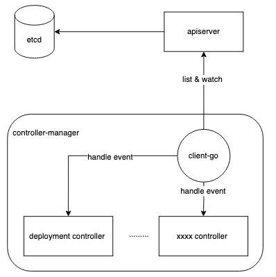

## controller

controller作为k8s集群中比较核心的组件，实现了k8s中资源的自愈功能。他的核心逻辑是对比k8s中资源的预期状态跟当前状态，若两个状态有所不同，则不断地**调谐（reconcile）**，最终让两个状态达到一致。

几乎每种资源都有特定的controller去承担该资源的**调谐（reconcile）** 工作，即使是自己定义的资源（CRD）也需要实现相应的controller。而controller-manager则是管理这些controller的控制器，controller-manager不仅管理者所有的controller，也为这些controller提供统一的k8s资源访问的入口，降低controller对apiserver访问的压力。

