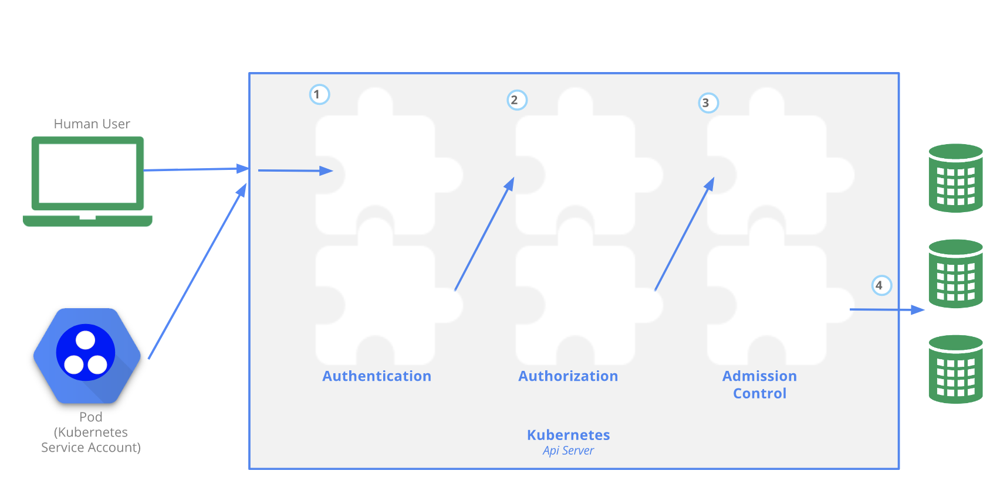

## [ApiServer权限控制](https://kubernetes.io/docs/concepts/security/controlling-access)
用户通过```kubectl```，客户端代码库，或者发送REST请求来访问ApiServer。这些请求都可能需要经过授权才能访问ApiServer。当一个请求到达Apiserver之后，通常需要经过下面的流程：

### 传输安全
ApiServer默认通过监听在第一张非localhost的网络接口上的6443端口来提供服务，由TLS提供加密保护。在一个典型的 Kubernetes 生产集群中，API使用443端口。该端口可以通过```--secure-port```参数来设置，监听IP地址可以通过```--bind-address```参数来设置。\
API 服务器出示证书。该证书可以使用私有证书颁发机构（CA）签名，也可以基于链接到公认的CA的公钥基础架构签名。该证书和相应的私钥可以通过使用```--tls-cert-file```和```--tls-private-key-file```参数进行设置。\
如果你的集群使用私有证书颁发机构，你需要在客户端的```~/.kube/config```文件中提供该CA证书的副本，以便你可以信任该连接并确认该连接没有被拦截。\
你的客户端可以在此阶段出示 TLS 客户端证书。

### 认证（Authentication）
如上图步骤1所示，建立TLS后，HTTP请求将进入认证步骤。集群创建脚本或者集群管理员配置ApiServer运行一个或多个身份认证组件。\
认证步骤会输入整个HTTP请求；但是，通常组件只检查头部或/和客户端证书。\
认证模块包含客户端证书、密码、普通令牌、引导令牌和 JSON Web 令牌（JWT，用于服务账户）。\
可以指定多个认证模块，在这种情况下，服务器依次尝试每个验证模块，直到其中一个成功。\
如果请求认证不通过，服务器将以HTTP状态码***401***拒绝该请求。反之，该用户被认证为特定的 username，并且该用户名可用于后续步骤以在其决策中使用。 

#### k8s的用户
k8s集群中有两种用户：用k8s管理的```Service Account```和普通用户。\
k8s假定普通用户是由一个与集群无关的服务通过以下方式之一进行管理的：
- 负责分发私钥的管理员
- 类似 Keystone 或者 Google Accounts这类用户数据库
- 包含用户名和密码列表的文件
基于此，***k8s并不包含用来代表普通用户账号的对象***。普通用户的信息无法通过ApiServer调用添加到集群中。\
尽管无法通过ApiServer调用来添加普通用户，k8s仍然认为能够提供由集群的证书机构签名的合法证书的用户是通过身份认证的用户。基于这样的配置，k8s使用证书中的 'subject' 的通用名称（Common Name）字段 （例如，"/CN=bob"）来确定用户名。接下来，基于角色访问控制（RBAC）子系统会确定用户是否有权针对某资源执行特定的操作。\
与此不同，```Service Account```是k8s管理的用户，是一种资源对象。它们被绑定到特定的名字空间，或由ApiServer自动创建，或由ApiServer调用创建。```Service Account```跟一组以```Secret```保存的凭据相关，这些凭据会被挂载到pod中，从而允许集群内的进程访问ApiServer。\
ApiServer的请求或与某普通用户相关联，或与某服务账号相关联，亦或被视作匿名请求。这意味着集群内外的每个进程在向ApiServer发起请求时都必须通过身份认证，否则会被视作匿名用户。

#### 认证策略
k8s通过身份认证插件利用客户端证书、持有者令牌（Bearer Token）或身份认证代理（Proxy）来认证ApiServer请求的身份。HTTP请求发给Apiserver时，插件会将以下属性关联到请求本身：

- Username：用来辩识最终用户的字符串。常见的值可以是 kube-admin 或 jane@example.com。
- UID：用来辩识最终用户的字符串，旨在比用户名有更好的一致性和唯一性。
- Groups：一组字符串，其中各个字符串用来标明用户是某个命名的用户逻辑集合的成员。常见的值可能是```system:masters```或者```devops-team```等。
- 附加字段：一组额外的键-值映射，键是字符串，值是一组字符串；用来保存一些鉴权组件可能觉得有用的额外信息。
所有（属性）值对于身份认证系统而言都是不透明的，只有被鉴权组件解释过之后才有意义。\

可以同时启用多种身份认证方法，并且通常会至少使用两种方法：
- 针对```Service Account```的tokens
- 至少另外一种方法对用户的身份进行认证
当集群中启用了多个身份认证模块时，第一个成功地对请求完成身份认证的模块会直接做出评估决定。 ApiServer并不保证身份认证模块的运行顺序。\
对于所有通过身份认证的用户都会被添加到```system:authenticated```组列表中。
#### x509客户端证书
通过打开```--client-ca-file=SOMEFILE```参数，可以启动客户端通过证书来做身份认证。所引用的文件必须包含一个或者多个证书机构，用来验证向ApiServer提供的客户端证书。如果提供了客户端证书并且证书被验证通过，则 subject中的公共名称（Common Name）就被作为请求的用户名。
### 鉴权（Authorization）
如上图的步骤2所示，将请求验证为来自特定的用户后，请求必须被鉴权。\
请求必须包含请求者的用户名、请求的行为以及受该操作影响的对象。 如果现有策略声明用户有权完成请求的操作，那么该请求被鉴权通过。\
假如有下面的策略：
```json5
{
    "apiVersion": "abac.authorization.kubernetes.io/v1beta1",
    "kind": "Policy",
    "spec": {
        "user": "bob",
        "namespace": "projectCaribou",
        "resource": "pods",
        "readonly": true
    }
}
```
则用户bob只拥有在```projectCaribou```命名空间下创建pods的权限，其他的权限都会被拒绝。\
Kubernetes 支持多种鉴权模块，例如```ABAC```模式、```RBAC```模式和```Webhook```模式等。管理员创建集群时，应该配置ApiServer服务器中使用的鉴权模块。\
如果配置了多个鉴权模块，则Kubernetes会检查每个模块，任意一个模块鉴权该请求，请求即可继续；如果所有模块拒绝了该请求，请求将会被拒绝，状态码为***403***。

### 准入控制（Admission control）
准入控制器是一段代码，它会在请求通过认证和授权之后、对象被持久化之前拦截到达ApiServer的请求。
准入控制器由于下面列表中的控制器组成，并且在该列表中，有两个特殊的控制器```MutatingAdmissionWebhook```和```ValidatingAdmissionWebhook```。 
它们根据ApiServer中的配置，分别执行变更（Mutating）和验证（Validating）的准入控制 webhook。\
准入控制器可以执行"验证（Validating）"或"变更（Mutating）"或者两者兼具的操作。 
变更（mutating）控制器可以根据被其接受的请求修改相关对象；验证（validating）控制器则不行。\
准入控制器只能限制创建、删除、修改对象或连接到代理的请求，不限制对对象的读取请求。\
准入控制过程分为两个阶段。第一阶段，运行变更准入控制器。第二阶段，运行验证准入控制器。\
如果两个阶段之一的任何一个控制器拒绝了某请求，则整个请求将立即被拒绝，并向最终用户返回错误。\
最后，除了对对象进行变更外，准入控制器还可能有其它副作用：将相关资源作为请求处理的一部分进行变更。 增加配额用量就是一个典型的示例，说明了这样做的必要性。 此类用法都需要相应的回收或回调过程，因为任一准入控制器都无法确定某个请求能否通过所有其它准入控制器。


### 审计（Auditing）
Kubernetes 审计提供了一套与安全相关的、按时间顺序排列的记录，其中记录了集群中的操作序列。集群对用户、使用Kubernetes API的应用程序以及控制平面本身产生的活动进行审计。