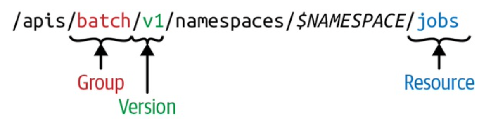

## control loop
通常来说，k8s的control loop的工作方式如下：
1. 由事件触发（ **event-driven** ）之后，读取资源的状态
2. 修改集群资源对象，比如拉起一个pod、创建一个endpoint等
3. 通过apiserver修改资源对象在etcd中状态
4. 重复循环，回到步骤1


## k8s的事件触发方式
原则上有两种检查状态发生变化的触发方式
- 边缘触发：每一次状态发生改变就触发事件
- 水平触发：定时对状态做检查，如果发现状态改变就触发事件

水平触发是一种轮询机制，在系统中资源对象数量增加的时候不具备很好的扩展能力。系统的延迟取决于轮询的间隔、系统中资源对象的数量还有事件的处理能力。\
边缘触发是一种更高效的机制，系统的延迟大部分取决于对事件的处理能力。\
在k8s的控制面组件中，有一些组件会通过apiserver修改资源对象的状态（每一次修改都会产生一个event），这种组件也就是 **event sources** 或者 **event provider** 。而controller的功能，更多聚焦于如何消费这些产生的 **event**，也就是事件的处理逻辑（通过 **informer** ）。\
在分布式系统中，存在多个组件同时运行，时间也是异步地不按顺序地产生。加上可能发生的网络异常，实际上事件非常容易丢失，所以在设计系统的时候，需要充分考虑这种情况。\
有3种不同的工作策略：
1. edge-driven-only logic：单一的边缘触发逻辑，无法应对事件丢失的场景
2. edge-triggered logic：当边缘触发的时候，基于对象的latest状态来执行行为逻辑。这种策略可以应对事件丢失的场景，但是会有一定的滞后性，因为需要在下一次事件触发之后才能修复。\
虽然叫边缘触发，实际上这种策略的逻辑更像是水平触发，只不过是不定时的检查（基于事件触发的时间间隔）
3. edge-triggered,level-driven logic with additional resync：在第二种策略的基础上，加上了定时的同步。

基于纯边缘触发会带来挑战，k8s的controller基本都采用了第三种策略

## 并发控制
在 **control loop** 的第三步中，会通过apiserver修改资源对象在etcd中的状态，而在k8s这样的分布式系统中，很有可能同时存在多个controller在修改同一个资源对象的情况。这个时候就涉及到并发写控制的问题。\
k8s采取"先来后到"的做法处理这种场景，即将"后到"的请求拒绝，并将请求失败返回给客户端自己处理。客户端可以自己决定是否重试。\
下面的伪代码可以阐述k8s在这一场景下的做法：
```golang
var err error
    for retries := 0; retries < 10; retries++ {
        foo, err = client.Get("foo", metav1.GetOptions{})
        if err != nil {
           break
        }
       <update-the-world-and-foo>
       _, err = client.Update(foo)
       if err != nil && errors.IsConflict(err) {
           continue
       } else if err != nil {
          break
       }
}
```
在通过```client.Update(foo)```更新资源对象信息到```etcd```之前就完成资源修改的操作，这种行为认为是乐观的。\
通过```client.Get()```返回的资源对象中包含了```resource version```(资源版本，在```ObjectMeta```结构中)这一属性。有了这个属性，```etcd```就能判断在当前客户端在更新的同时有没有其他客户端已经完成了更新的操作，如果有，就返回写冲突。

> k8s的```resource version```实际上就是```etcd```的```key/value version```。是一个依次递增的整数，由```etcd```维护，每次```key```的```value```被修改更新之后，```resource version```就会加一。

需要意识到的是，冲突在controller中是非常常见的，controller的逻辑要需要优雅地处理这些冲突。\
并发控制完美地适配水平触发的轮询机制，因为即使当前的这一次修改只修改了资源，但是没有将资源的状态更新到etcd中，下一次循环会抹除上一次的修改，并将修改的内容尝试更新到etcd。\

## K8S API 专有名词

- kind：一个资源对象的类型，每个资源对象都有一个字段```kind```来标识自己的资源类型。有三种不同类型的```kind```
    - pod或者node这种代表单个对象的
    - podlist或者nodelist这种代表一个或者多个对象的集合
    - 特殊用途的```kind```，用于表示对资源对象的操作的，比如```scale```、```binding```等；用于服务发现的```APIGroup```和```APIResource```；```status```表示状态。
- API Group：一些逻辑上相关联的```kind```的集合。如```Job```和```ScheduledJob```属于```batch```的```APIGroup```
- Version：每个```APIGroup```都可以同时存在多个版本```version```。一个资源对象用某个```version```创建之后也可以用另外任何一个```version```检索出来。```apiserver```需要在不同的版本之间做无损的转换。
> 严格来说，"资源A在系统中属于版本v1，资源B在系统中属于版本v1beta1"这种说法是不对的，每个资源对象在系统中既能够以v1的版本展示出来，也能够以v1beta1的版本展示出来。

- Resource：一般是小写、复数的，例如pods。用于标识一个HTTP请求的路径，通常的路径是
    - .../pods，会返回当前集合的所有资源对象
    - .../pods/nginx，只会返回当前集合中以nginx命名的pod
> Resources跟kinds两个经常容易搞混
> - Resources相当于HTTP请求路径
> - Kinds是HTTP请求路径返回的资源对象，也是etcd中持久化的对象

每一个```GroupVerisonResource(GVR)```都定义了一个HTTP路径。下图展示了一个具有namespace属性的资源，如```Job```，他的```GVR```是如何关联HTTP路径的：

与```GVR```类似，每一个```kind```也都单独可以用```GroupVersionKind(GVK)```来定义。\
```GVRs```跟```GVKs```直接是有联系的。由```GVRs```定义的HTTP请求路径服务于```GVKs```定义的资源。```GVK```到```GVR```直接的映射称为```REST mapping```。

## Go语言中的k8s对象
k8s资源对象，即```kind```的实例，在APIServer中是以结构体的形式存在。根据```kind```的不同，结构体的字段不同，但是整体的架构是一致的。
```golang
type Object interface {
    GetObjectKind() schema.ObjectKind
    DeepCopyObject() Object
}
```
## API Machinery
```API Machinery```库构造了k8s中```type system```的基础。这里所说的```type```指的就是上文提到的```kind```。\


